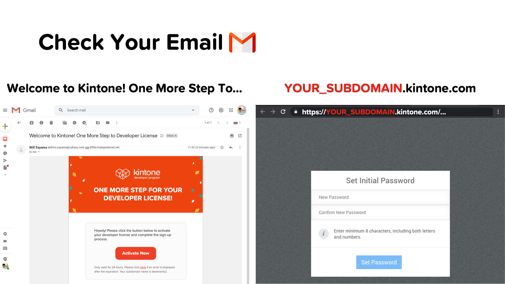

# Hosting Your React App with Web Database


## Live walk-through hosting your React App on Vercel and Netlify hosting services! Compare and contrast live!

## Outline <!-- omit in toc -->
* [Completed Project](#completed-project)
* [Get Started](#get-started)
* [Get Your Free Kintone Database](#get-your-free-kintone-database)
* [Workshop Steps](#workshop-steps)
* [Debugging](#debugging)
  * [Not seeing a highlighted `TODO:`?](#not-seeing-a-highlighted-todo)
* [Completed Code](#completed-code)
* [Overview of the Repo](#overview-of-the-repo)

## Completed Project


## Get Started
_Clone the Repo & Install Dependencies_ 💪

First, clone the [kintone-workshops/host-react-app-database](https://github.com/kintone-workshops/host-react-app-database) repo!  🚀  
Then go inside the folder & install the dependencies!

```shell
cd Downloads

git clone https://github.com/kintone-workshops/host-react-app-database

cd host-react-app-database

npm install

```

Open the `host-react-app-database` folder in [VS Code](https://code.visualstudio.com/docs/getstarted/tips-and-tricks#_command-line) as well:

```shell
code .
```

## Get Your Free Kintone Database

[kintone.dev/new/](http://kintone.dev/new/)
* ⚡ Only use lowercase, numbers, & hyphens in your subdomain
* ⚠ Do not use uppercase or special characters

|                                                                                                               |                                                                                                                                 |
| ------------------------------------------------------------------------------------------------------------- | ------------------------------------------------------------------------------------------------------------------------------- |
|          |  |
|  |                                                               |

For more information, check out the [Workshop_Steps.md > B. Get Your Free Kintone Database](./docs/Workshop_Steps.md#b-get-your-free-kintone-database) section!

---

## Workshop Steps

* [A. Get started - clone the repo \& install dependencies](./docs/Workshop_Steps.md#a-get-started---clone-the-repo--install-dependencies)
* [B. Get your free Kintone database](./docs/Workshop_Steps.md#b-get-your-free-kintone-database)
* [C. Create a `.env` file](./docs/Workshop_Steps.md#c-create-a-env-file)
* [D. Create a Kintone web database app](./docs/Workshop_Steps.md#d-create-a-kintone-web-database-app)
  * [Input Fields](./docs/Workshop_Steps.md#input-fields)
  * [Steps to create the Kintone App](./docs/Workshop_Steps.md#steps-to-create-the-kintone-app)
* [E. Generate an API token for the Kintone app](./docs/Workshop_Steps.md#e-generate-an-api-token-for-the-kintone-app)
* [F. Let's start coding!](./docs/Workshop_Steps.md#f-lets-start-coding)
  * [1. Create two new folders to work in, and copy the backend code to them](./docs/Workshop_Steps.md#1-create-two-new-folders-to-work-in-and-copy-the-backend-code-to-them)
  * [2. Create and setup config files for Netlify and Vercel](./docs/Workshop_Steps.md#2-create-and-setup-config-files-for-netlify-and-vercel)
  * [3. Time to upload our code from GitHub, and setup our deployments!](./docs/Workshop_Steps.md#3-time-to-upload-our-code-from-github-and-setup-our-deployments)

---

## Debugging
**Let's Fix Those Problems** 💪

Here is a rundown of common problems that may occur & their solutions!

### Errors related to .env

If you get one of the following error messages:  

* `[webpack-cli] Error: Missing environment variable: KINTONE_BASE_URL`
* `[webpack-cli] Error: Missing environment variable: KINTONE_PASSWORD`
* `[webpack-cli] Error: Missing environment variable: KINTONE_USERNAME`
* `[webpack-cli] Error: Missing environment variable: VIEW_ID`
* `[webpack-cli] TypeError: Cannot convert undefined or null to object`
* `Failed to find .env file at default paths: [./.env,./.env.js,./.env.json]`
* `Failed to find .env file at default paths: [./.env,./.env.js,./.env.json]`
* `Failed to upload JavaScript/CSS files`
* `KintoneRestAPIError: [520] [CB_WA01] Password authentication failed...`

Then please verify that
* your `.env` file has been correctly configured
* your username and password for your Kintone account are correct
* you have not modified the `.env.example`

### Errors related to Node.js & npm

Error Message:

```shell
vite build --emptyOutDir

internal/process/esm_loader.js:74
    internalBinding('errors').triggerUncaughtException(
                              ^

Error [ERR_UNSUPPORTED_ESM_URL_SCHEME]: Only file and data URLs are supported by the default ESM loader. Received protocol 'node:'
    at Loader.defaultResolve [as _resolve] (internal/modules/esm/resolve.js:782:11)
    at Loader.resolve (internal/modules/esm/loader.js:85:40)
    at Loader.getModuleJob (internal/modules/esm/loader.js:229:28)
    at ModuleWrap.<anonymous> (internal/modules/esm/module_job.js:51:40)
    at link (internal/modules/esm/module_job.js:50:36) {
  code: 'ERR_UNSUPPORTED_ESM_URL_SCHEME'
}
```

Solution:

```shell
cd host-react-app-database
npm install
```

### `npm install` command is not working

1. Verify the Node.js & npm versions **inside** the `host-react-app-database` folder
2. Just installed Node.js? Verify you configured Node.js versions **inside** the `host-react-app-database` folder

* Mac:`nodenv install 18.16.1 && nodenv local 18.16.1`
* Windows: `nvm install 18.16.1 && nvm use 18.16.1`

Not the correct versions, or confused? 🤔 → Check out the [Guide on Installing Node.js & npm {macOS & Windows}](https://dev.to/kintonedevprogram/guide-on-installing-nodejs-npm-macos-windows-16ii).

(2) Verify that the .env login info is correct (including the password)
* ⚠️ Make sure your login info is inside the `.env` file & **NOT** the `.env.example` file!
* ⚠️ Verify that KINTONE_BASE_URL input is correctly formatted:
  * ✅ Correct Format: `https://example.kintone.com`
  * ❌ Incorrect Format: `https://example.kintone.com/` or `example.kintone.com`
* ⚠️ Re-run the npm commands after saving the .env file
* ⚙️ Details: [Step 4 - Create a `.env` File](./docs/Workshop_Steps.md#step-4---create-a-env-file-)

(3) Verify your [customize-manifest.json](customize-manifest.json) was updated with the correct App ID
* ⚙️ Details: [Step 5 - Update customize-manifest.json with the App ID](./docs/Workshop_Steps.md#step-5---update-customize-manifestjson-with-the-app-id-)

(4) Verify that the `npm run build` command was run before the `npm run upload`

### Not seeing a highlighted `TODO:`?
Click the `Install` button on the VS Code pop-up message to install [TODO Highlight extension](https://marketplace.visualstudio.com/items?itemName=wayou.vscode-todo-highlight).
* [](./docs/img/common_vscode/vscode-setting-extension-HD.png)  

---

## Overview of the Repo

<details>
  <summary> ↯ Overview of the Repo ↯ </summary>

| File                                                         | Purpose                                                                   | Need to Modify?        |
| ------------------------------------------------------------ | ------------------------------------------------------------------------- | ---------------------- |
| [package.json](package.json)                                 | Project's metadata & scripts for building and uploading the customization |                        |
| [.env.example](.env.example)                                 | The template for the .env file                                            |                        |
| [.env](.env)                                                 | Holds the Kintone login credential and View ID                            | Yes! - Create it       |
| [docs/Workshop_Steps.md](./docs/Workshop_Steps.md)           | Step-by-step guide that we do during the workshop                         |                        |

</details>
